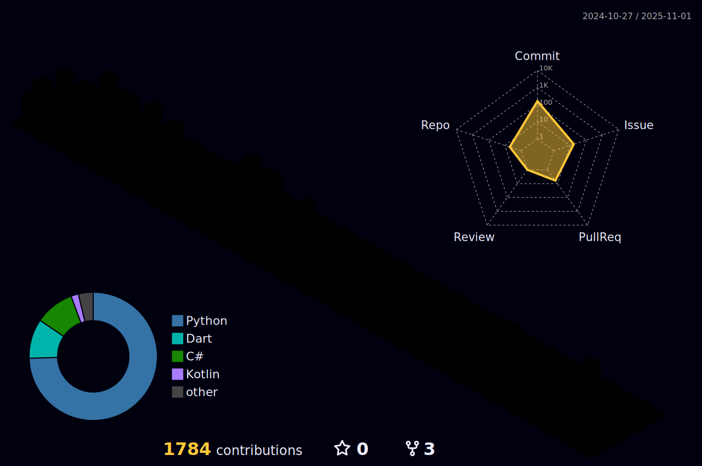

# Hello There!

 

  

---

## About Me

- 🥋 My name is João Guilherme B. A. Rezende  
- 📚 Currently working on game development projects with the BCC Coworking research team at my college, focusing on software engineering and educational methods  
- 🕹️ Studying Unity, programming languages, their mathematical applications, best practices in software engineering, machine learning and large language models (LLMs)  
- 🎓 Computer Science student (8/9)  
- 🚀 Interning at Buzzmonitor, gaining theoretical and practical experience in backend development and AI  
- 📫 How to reach me:  
  - Email: [benj7100@gmail.com](mailto:benj7100@gmail.com)  
  - LinkedIn: [João Guilherme Benjamin Alves de Rezende](https://www.linkedin.com/in/bennie10colado/)  

  

---

## GitHub 3D Contributions

---

## Commits Snake Animation

---

## Skills & Tools

  <!-- Programming Languages -->
  
  
  
  
  
  <!-- Frameworks & Platforms -->
  
  
  <!-- Web Technologies -->
  
  
  
  <!-- Development Tools -->
  
  <!-- Game Development -->
  
  
  <!-- Databases & Back-end -->
  
  

